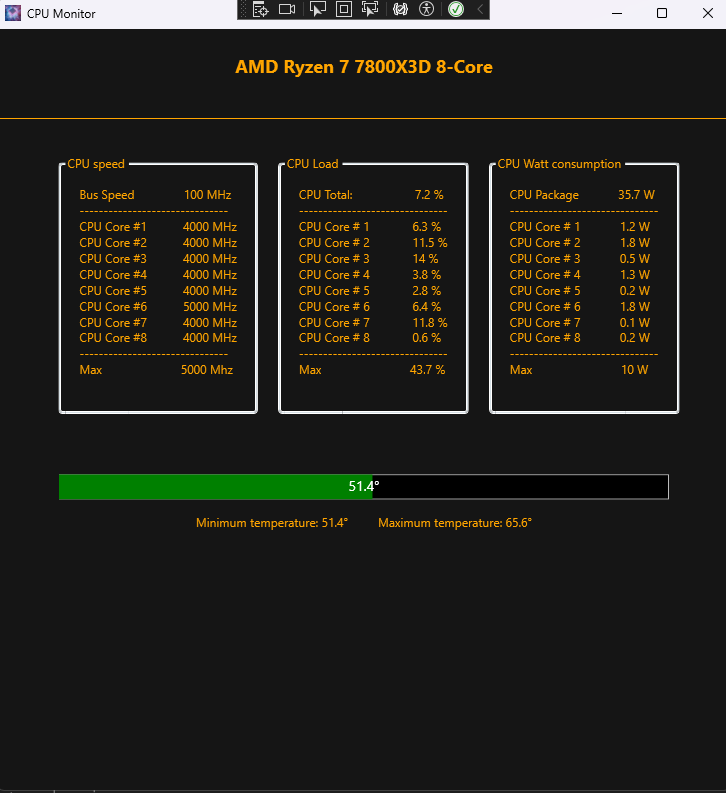

**Hardware Monitor** is a real-time CPU and hardware monitoring application built with **WPF (Windows Presentation Foundation)** and powered by **LibreHardwareMonitor**. It provides a sleek and interactive GUI to display detailed system metrics such as:

- CPU temperature, clock speed, loads, and power usage
- GPU statistics
- Memory usage
- Storage activity
- Motherboard sensors

## Features

- 📈 Live hardware monitoring via `LibreHardwareMonitor`
- 🎛️ Intuitive interface with gauges powered by **Syncfusion**
- 📊 Dynamic charts using **CartesianChart**
- 🖥️ Multi-component hardware readout (CPU, GPU, RAM, disks, motherboard)
- ⚡ Optimized for performance with asynchronous data fetching

## Technologies Used

- [.NET / WPF](https://learn.microsoft.com/en-us/dotnet/desktop/wpf/)
- [LibreHardwareMonitor](https://github.com/LibreHardwareMonitor/LibreHardwareMonitor)
- [Syncfusion WPF Controls](https://www.syncfusion.com/wpf-controls)
- [LiveCharts](https://github.com/Live-Charts/Live-Charts)

🗂️ Project Structure

CpuReader/
│
├── Enums/                    # Enum definitions for CPU types, states, etc.
├── Extensions/               # Helper extension methods for sensor processing
│   └── HardwareExtensions.cs
├── Helpers/                  # Utility classes for UI updates and more
├── Models/                   # Data models for CPU stats
├── Properties/               # App properties and assembly info
├── Service/                  # Business logic and hardware abstraction
│   ├── Interfaces/
│   └── Classes/
├── Singleton/                # Singleton implementation for hardware state
├── bin/                      # Binary output (auto-generated)
├── obj/                      # Build artifacts (auto-generated)
│
├── App.xaml                 # Application definition
├── App.xaml.cs              # App startup logic
├── AssemblyInfo.cs          # Assembly metadata
├── CpuReader.csproj         # Project file
├── CpuReader.sln            # Solution file
├── MainWindow.xaml          # Main WPF UI layout
├── MainWindow.xaml.cs       # Main window logic (CPU monitor loop)
├── app.manifest             # Manifest configuration
├── favicon.ico              # App icon
└── .gitignore               # Git ignored files

🚀 Getting Started
Prerequisites

    .NET Framework (or .NET Core) compatible with WPF

    Visual Studio 2019+ (or equivalent IDE)

    NuGet package:

        LibreHardwareMonitorLib

Setup

    Clone the repository:

    git clone https://github.com/yourusername/CpuReader.git
    cd CpuReader

    Open the solution in Visual Studio:

        Open CpuReader.sln

        Restore NuGet packages

        Build and run the solution

🛠 How It Works

    On application start, a BackgroundWorker is initialized to run every second.

    It collects CPU data via HardWareService (using LibreHardwareMonitor).

    The data is processed and stored in a singleton (HardWareSingleton).

    UI updates are triggered using helper methods (like UIUpdater.RunCpuUI).

